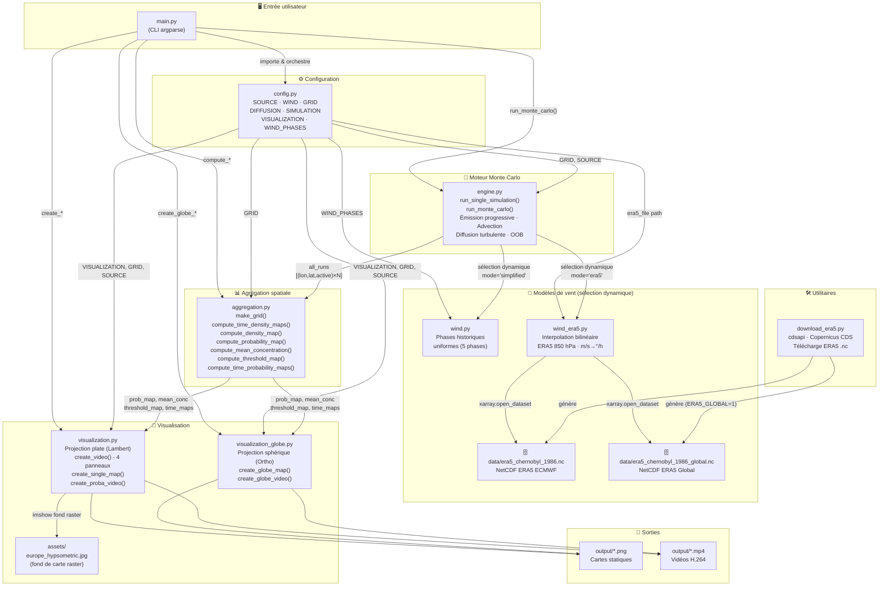

# Documentation Technique — MonteCarloSimu
## Simulation Monte Carlo de Dispersion Atmosphérique — Tchernobyl 1986

> **Version** : 1.0 · **Date** : Février 2026  
> Modèle lagrangien particulaire simulant la propagation du nuage radioactif de Tchernobyl
> (26 avril – 16 mai 1986) sur l'Eurasie, à partir des données de vent réelles ERA5 (ECMWF).

---

## Table des matières

1. [Vue d'ensemble](#1-vue-densemble)
2. [Architecture et schéma des dépendances](#2-architecture-et-schéma-des-dépendances)
3. [Flux de données](#3-flux-de-données)
4. [Description détaillée des modules](#4-description-détaillée-des-modules)
5. [Référence des fonctions publiques](#5-référence-des-fonctions-publiques)
6. [Référence de configuration (config.py)](#6-référence-de-configuration-configpy)
7. [Interface en ligne de commande (CLI)](#7-interface-en-ligne-de-commande-cli)
8. [Modes de rendu](#8-modes-de-rendu)
9. [Structure des données internes](#9-structure-des-données-internes)
10. [Guide de démarrage rapide](#10-guide-de-démarrage-rapide)
11. [Tests unitaires](#11-tests-unitaires)

---

## 1. Vue d'ensemble

### Principe physique

Le modèle résout l'**équation d'advection–diffusion** en approche lagrangienne :

$$\vec{x}(t + \Delta t) = \vec{x}(t) + \vec{u}(\vec{x}, t)\,\Delta t + \boldsymbol{\xi}$$

où :
- $\vec{x}(t)$ = position géographique de la particule (lon, lat) en degrés
- $\vec{u}(\vec{x}, t)$ = vecteur vent local (ERA5 interpolé ou phases historiques) en °/h
- $\boldsymbol{\xi} \sim \mathcal{N}(0,\,\sqrt{2K\Delta t})$ = bruit de diffusion turbulente gaussien

### Pipeline de simulation

```
Entrée (ERA5 .nc ou phases)
        │
        ▼
┌─────────────────┐    N runs     ┌──────────────────────────┐
│   engine.py     │ ─────────────► │  Liste de trajectoires   │
│ run_monte_carlo │               │ [(lon, lat, active) × 12] │
└─────────────────┘               └─────────────┬────────────┘
                                                │
                                        ┌───────▼───────┐
                                        │ aggregation.py │
                                        │  → prob_map    │
                                        │  → threshold   │
                                        │  → density     │
                                        └───────┬───────┘
                                                │
                              ┌─────────────────┼──────────────────┐
                              ▼                 ▼                  ▼
                    visualization.py   visualization_globe.py   output/
                    (projection plate)  (projection sphérique)   *.png / *.mp4
```

---

## 2. Architecture et schéma des dépendances

### 2.1 Schéma complet des dépendances inter-modules

```
┌─────────────────────────────────────────────────────────────────────────┐
│                            POINT D'ENTRÉE                               │
│                              main.py                                    │
│              CLI (argparse) · orchestration · journalisation            │
└──────┬──────────┬──────────────┬──────────────┬────────────────────────┘
       │          │              │              │
       │ importe  │ importe      │ importe      │ importe
       ▼          ▼              ▼              ▼
┌──────────┐ ┌──────────┐ ┌──────────────┐ ┌────────────────────┐
│ config.py│ │ engine.py│ │aggregation.py│ │  visualization.py  │
│          │ │          │ │              │ │  visualization_    │
│ SOURCE   │ │run_monte │ │make_grid()   │ │  globe.py          │
│ WIND     │ │_carlo()  │ │compute_*()   │ │  create_video()    │
│ GRID     │ │run_single│ │              │ │  create_single_map │
│ DIFFUSION│ │_simul.() │ │              │ │  create_proba_     │
│ SIMULAT. │ │          │ │              │ │  video()           │
│ VISUALIZ.│ └────┬─────┘ └─────┬────────┘ └──────────┬─────────┘
│ WIND_    │      │              │                     │
│ PHASES   │      │ importe      │ importe             │ importe
└────┬─────┘      ▼              │                     │
     │      ┌─────────────┐      │                     │
     │      │   MODÈLES   │      │                     │
     │      │   DE VENT   │      │                     │
     │      │  (sélection │      │                     │
     │      │  dynamique) │      │                     │
     │      └──┬──────┬───┘      │                     │
     │         │      │          │                     │
     │    ┌────▼──┐ ┌─▼────────┐ │                     │
     │    │wind.py│ │wind_era5 │ │                     │
     │    │       │ │.py       │ │                     │
     │    │get_   │ │get_wind()│ │                     │
     │    │wind() │ │_load()   │ │                     │
     │    │phases │ │_interpol.│ │                     │
     │    │histor.│ │ERA5.nc ◄─┼─┘                     │
     │    └───┬───┘ └────┬─────┘                       │
     │        │          │                             │
     └────────┴──────────┴─────────────────────────────┘
                    importe config.py
```

### 2.2 Schéma Mermaid (rendu GitHub / Obsidian)



### 2.3 Dépendances Python externes

| Module projet       | Bibliothèques externes utilisées                                           |
|---------------------|----------------------------------------------------------------------------|
| `config.py`         | *(aucune)*                                                                 |
| `engine.py`         | `numpy`                                                                    |
| `wind.py`           | `numpy`                                                                    |
| `wind_era5.py`      | `numpy`, `xarray`, `scipy.interpolate.RegularGridInterpolator`            |
| `aggregation.py`    | `numpy`                                                                    |
| `visualization.py`  | `numpy`, `matplotlib`, `cartopy`, `os`, `datetime`                        |
| `visualization_globe.py` | `numpy`, `matplotlib`, `cartopy`, `scipy.ndimage.gaussian_filter`    |
| `main.py`           | `argparse`, `time`, `os`, `numpy`                                         |
| `download_era5.py`  | `cdsapi`, `xarray`, `os`, `sys`                                           |

---

## 3. Flux de données

### 3.1 Flux principal (mode ERA5)

```
1. main.py
   ├── Lit les arguments CLI (--mode, --resolution, --particles, --globe)
   ├── Met à jour SIMULATION, VISUALIZATION, GRID si nécessaire
   │
2. engine.run_monte_carlo()          → appelle N fois run_single_simulation()
   │
   ├── Pour chaque pas de temps t (0 → 480h) :
   │   ├── wind_era5.get_wind(lons, lats, t)
   │   │   ├── wind_era5._load()          → charge ERA5.nc (singleton)
   │   │   ├── wind_era5._interpolator()  → RegularGridInterpolator (cache 30)
   │   │   ├── Interpolation bilinéaire spatiale (lat, lon)
   │   │   ├── Interpolation linéaire temporelle (t)
   │   │   └── + bruit turbulent proportionnel au vent local
   │   │
   │   ├── Advection : lon += u*dt,  lat += v*dt
   │   ├── Diffusion : lon += N(0, √2K·dt),  lat += N(0, √2K·dt)
   │   └── Désactivation hors-domaine (ou wrap périodique en mode globe)
   │
   └── Retourne : traj_lon[481, N], traj_lat[481, N], active[481, N]

3. aggregation.py
   ├── make_grid()             → lon_edges[351], lat_edges[201]
   ├── compute_time_density_maps()    → maps[481, 200, 350]
   ├── compute_probability_map()      → prob_map[200, 350] ∈ [0,1]
   ├── compute_mean_concentration()   → mean_conc[200, 350] ∈ [0,1]
   ├── compute_threshold_map()        → threshold_map[200, 350] ∈ [0,1]
   └── compute_time_probability_maps()→ prob_maps[481, 200, 350] (vidéo)

4. visualization.py  OU  visualization_globe.py
   └── Génère PNG/MP4 dans output/
```

### 3.2 Format des trajectoires (`all_runs`)

```python
all_runs = [
    (traj_lon,  # ndarray float64 (n_steps+1, n_particles) — degrés
     traj_lat,  # ndarray float64 (n_steps+1, n_particles) — degrés
     active),   # ndarray bool    (n_steps+1, n_particles) — particule active?
    ...         # × n_runs (12 par défaut)
]
```

Les particules **inactives** conservent leur dernière position connue (pas de `NaN`) et sont masquées lors des calculs d'agrégation via `active`.

### 3.3 Émission progressive des particules

```
Étape 0  : release_schedule[0] particules activées à (lon0±ε, lat0±ε)
Étape 1  : release_schedule[1] nouvelles particules activées
...
Étape emission_steps-1 : dernières particules activées
Après   : toutes les n_particles sont actives (si dans le domaine)
```

`emission_steps = min(emission_duration_h / dt, n_steps)` = 240 pas (10 jours).

---

## 4. Description détaillée des modules

### `config.py` — Configuration centralisée

Fichier de configuration **pur Python** (pas d'imports), contenant tous les paramètres du projet sous forme de dictionnaires. **Aucun calcul n'est effectué ici.**

| Dictionnaire    | Rôle                                                                 |
|-----------------|----------------------------------------------------------------------|
| `SOURCE`        | Position de la source (51.39°N, 30.10°E), taux et durée d'émission  |
| `WIND_PHASES`   | 5 phases historiques de vent (direction/intensité par tranche horaire)|
| `WIND`          | Mode de vent (`"era5"` / `"simplified"`), chemin .nc, turbulence     |
| `DIFFUSION`     | Coefficients $K_{lon}$ et $K_{lat}$ en °²/h                          |
| `GRID`          | Domaine géographique et résolution (350×200 cellules sur Europe)     |
| `SIMULATION`    | n_particles, dt (1h), n_steps (480 = 20 jours), n_runs (12), seed   |
| `VISUALIZATION` | DPI, figsize, colormaps, save_dir, paramètres vidéo (fps, bitrate)   |

---

### `engine.py` — Moteur Monte Carlo

**Responsabilité :** exécuter la simulation lagrangienne de toutes les particules sur 480 pas de temps.

**Sélection dynamique du modèle de vent** (au chargement du module) :
```python
if WIND["mode"] == "era5":
    from wind_era5 import get_wind   # Interpolation ERA5
else:
    from wind import get_wind         # Phases historiques uniformes
```

| Fonction                 | Signature                         | Description                                                |
|--------------------------|-----------------------------------|------------------------------------------------------------|
| `run_single_simulation`  | `(seed=None) → (lon, lat, active)`| Un run complet sur 480h avec émission progressive          |
| `run_monte_carlo`        | `() → list[(lon, lat, active)]`   | Lance `n_runs` simulations avec seeds `base_seed + i`      |
| `_is_global_lon_grid`    | `() → bool`                       | Détecte si la grille couvre tout le globe (mode --globe)   |
| `_wrap_lon_to_grid`      | `(lon) → lon`                     | Repliement périodique des longitudes (dateline)            |

**Comportement aux bords :**
- Mode régional (Europe) : les particules sortant du domaine sont **désactivées** définitivement
- Mode globe (`--globe`) : les longitudes sont **repliées périodiquement** (≈ sphère torique)

---

### `wind.py` — Modèle de vent simplifié

**Responsabilité :** fournir un vent uniforme par phase historique.

Le vent est **spatialement uniforme** (toutes les particules reçoivent le même vent de base) avec une transition douce de 6h entre phases.

| Phase | Période           | Direction       | Événement historique               |
|-------|-------------------|-----------------|------------------------------------|
| 1     | 0–48h (26-27 avr) | N-NW → 0.18°/h  | Nuage vers Scandinavie             |
| 2     | 48–96h (28-29 avr)| W → -0.15°/h    | Vers Pologne, Baltique             |
| 3     | 96–168h (30 avr – 2 mai) | S-SW   | Vers Ukraine, Roumanie, Turquie    |
| 4     | 168–264h (3-5 mai)| W fort (-0.18°/h)| Vers Europe centrale, France       |
| 5     | 264–480h (6-10 mai)| Variable faible | Dispersion large                   |

**Turbulence :** fluctuations gaussiennes $\mathcal{N}(0, u_{std})$ ajoutées à chaque particule individuellement.

---

### `wind_era5.py` — Interpolation ERA5

**Responsabilité :** fournir le vent local interpolé à chaque position de particule depuis les données ERA5.

**Architecture Singleton + Cache :**

```
_era5 = None                  ← données chargées UNE SEULE FOIS en mémoire
_interp_cache = {}            ← LRU cache des interpolateurs (max 30 entrées)
```

**Pipeline d'interpolation :**
1. `_load(path)` → chargement NetCDF, normalisation lat croissante, conversion timestamp → heures depuis accident
2. Recherche des deux pas de temps encadrants (`t_idx`, `t_idx+1`)
3. `_interpolator(t_idx, "u/v")` → `RegularGridInterpolator` bilinéaire sur grille (lat, lon)
4. Interpolation spatiale à `t_idx` ET `t_idx+1`
5. Interpolation temporelle linéaire (pondération $\alpha$)
6. Conversion m/s → °/h avec correction $\cos(\phi)$ pour la composante zonale
7. Ajout du bruit turbulent proportionnel à $|\vec{u}|$

**Gestion des conventions ERA5 :**
- Détecte automatiquement si les longitudes sont en [0,360] ou [-180,180]
- Gère les deux noms de variables : `"u"/"v"` ou `"u_component_of_wind"/"v_component_of_wind"`
- Avertissement si le domaine ERA5 est plus petit que la grille de simulation

---

### `aggregation.py` — Agrégation spatiale

**Responsabilité :** projeter les trajectoires particule sur une grille géographique et calculer les cartes statistiques.

Toutes les fonctions utilisent `np.histogram2d` via le helper interne `_histogram2d_on_grid`.

| Fonction                       | Entrée                          | Sortie                              | Formule                                       |
|--------------------------------|---------------------------------|-------------------------------------|-----------------------------------------------|
| `make_grid()`                  | *(config)*                      | lon_edges, lat_edges, centers×2     | `linspace` sur GRID                           |
| `compute_time_density_maps()`  | traj_lon, traj_lat, active      | `(n_steps, nlat, nlon)`             | histogramme 2D à chaque instant               |
| `compute_density_map()`        | traj_lon, traj_lat, active      | `(nlat, nlon)` normalisé [0,1]      | histogramme cumulé / max                      |
| `compute_probability_map()`    | all_runs                        | `(nlat, nlon)` ∈ [0,1]             | $P = \frac{\#\text{runs où cellule visitée}}{N_{runs}}$ |
| `compute_mean_concentration()` | all_runs                        | `(nlat, nlon)` normalisé [0,1]      | moyenne des densités sur les runs             |
| `compute_threshold_map()`      | all_runs, threshold=0.05        | `(nlat, nlon)` ∈ [0,1]             | $P(C > C_{seuil})$ sur les runs               |
| `compute_time_probability_maps()` | all_runs                     | `(n_steps, nlat, nlon)` float32     | $P_t$ = fraction de runs avec ≥1 particule    |

**Gestion du domaine global (mode --globe) :**
`_histogram2d_on_grid` replie les longitudes périodiquement quand `lon_span ≈ 360°`.

---

### `visualization.py` — Rendu 2D (projection plate)

**Responsabilité :** générer les visualisations en projection **Lambert Conforme** (cartes statiques) ou **PlateCarrée** (vidéos).

**Projection cartographique :**
```python
# Cartes statiques single map
proj = ccrs.LambertConformal(central_longitude=30.0, central_latitude=52.0,
                              standard_parallels=(40, 60))
# Vidéos 4-panneaux
data_crs = ccrs.PlateCarree()
```

| Fonction              | Description                                                                 |
|-----------------------|-----------------------------------------------------------------------------|
| `create_single_map()` | Image PNG plein écran (un seul mode de rendu)                               |
| `create_video()`      | Vidéo MP4 avec 4 panneaux animés (nuage, densité, probabilité, seuil)      |
| `create_proba_video()`| Vidéo heatmap probabiliste animée (fond raster + colormap `YlOrRd`)         |
| `_setup_map_ax()`     | Configure un axe Cartopy (fond raster + côtes + frontières + villes)        |
| `_add_cities()`       | Place 15 villes européennes sur la carte                                    |
| `_get_wind_phase()`   | Retourne le label de la phase de vent pour un instant donné                 |

**Fond de carte :**
- Priorité : `assets/europe_hypsometric.jpg` (Natural Earth Hypsometric)
- Fallback : `ax.stock_img()` (Blue Marble Matplotlib/Cartopy)

---

### `visualization_globe.py` — Rendu sphérique (projection globe)

**Responsabilité :** rendu cinématographique sur projection **Orthographique** centrée sur l'Europe (25°E, 50°N).

**Particularités techniques :**
- Cartopy `Orthographic` ne supporte **pas** `imshow` → utilisation de `pcolormesh` (shading `"flat"`)
- Lissage gaussien systématique avant rendu (`scipy.ndimage.gaussian_filter`, σ=1.5)
- Colormap inferno custom avec **alpha progressif intégré** (transparence des faibles valeurs)
- Normalisation `PowerNorm(γ=0.5)` pour amplifier les faibles probabilités

**Mise à l'échelle adaptive :**
```python
def _s(base):
    return base * (figsize_width_px) / 2560.0  # ratio par rapport à 2K
```
Toutes les tailles de police et marqueurs s'adaptent automatiquement à la résolution.

| Fonction              | Description                                                              |
|-----------------------|--------------------------------------------------------------------------|
| `create_globe_map()`  | Image PNG statique sur globe orthographique                              |
| `create_globe_video()`| Vidéo MP4 animée sur globe (heatmap probabiliste)                        |
| `_setup_globe()`      | Globe cinématographique : Blue Marble désaturé + overlays sombres        |
| `_build_cmap()`       | Construit la colormap inferno avec alpha progressif                      |

---

### `main.py` — Point d'entrée CLI

**Responsabilité :** orchestrer l'ensemble du pipeline, gérer les arguments CLI, afficher la progression.

**Priorité de configuration (ordre décroissant) :**
```
1. Argument CLI (--mode, --resolution, --particles)
2. config.py (VISUALIZATION["render_mode"], SIMULATION["n_particles"])
3. Valeurs par défaut
```

**Gestion du mode globe (`--globe`) :**
- Étend la grille à [-180,180] × [-90,90] (720×360 cellules)
- Bascule sur le fichier ERA5 global si disponible
- Redirige vers `visualization_globe.py` pour tous les rendus

**Aliases de mode :**

| Alias CLI         | Mode interne   |
|-------------------|----------------|
| `pv`, `heatmap`   | `proba_video`  |
| `proba`, `prob`   | `probability`  |
| `all`, `video`    | `all`          |
| `cumul`           | `cumulative`   |
| `instant`, `cloud`| `instant`      |
| `seuil`           | `threshold`    |
| `globe`, `gv`     | `globe` / `globe_video` |

---

### `download_era5.py` — Téléchargeur ERA5

**Responsabilité :** télécharger les données de vent ERA5 depuis le Copernicus Climate Data Store.

**Fonctionnement :**
1. Vérifie `~/.cdsapirc` (token Copernicus)
2. Deux requêtes séparées : Avril 26-30 + Mai 1-16, 1986
3. Fusion et sauvegarde en `data/era5_chernobyl_1986.nc`
4. Variable `ERA5_GLOBAL=1` → télécharge la couverture mondiale (`era5_chernobyl_1986_global.nc`)

**Données téléchargées :**
- Variables : `u_component_of_wind`, `v_component_of_wind` à 850 hPa
- Résolution : 0.25° × 0.25°, horaire
- Domaine régional : [-12°W → 75°E, 33°N → 72°N] (~27 Mo)
- Domaine global : [-180° → 180°, -90° → 90°] (~quelques centaines de Mo)

---

## 5. Référence des fonctions publiques

### `engine.py`

```python
run_single_simulation(seed=None) -> (traj_lon, traj_lat, active)
```
- `seed` : graine NumPy (`int` ou `None`)
- Retourne des tableaux de forme `(n_steps+1, n_particles)`
- `active[t, p]` vaut `True` si la particule `p` est vivante à `t`

```python
run_monte_carlo() -> list[tuple[ndarray, ndarray, ndarray]]
```
- Lit `SIMULATION["n_runs"]` et `SIMULATION["seed"]` depuis `config.py`
- Retourne `n_runs` tuples `(traj_lon, traj_lat, active)`

---

### `wind.py`

```python
get_wind(lons, lats, t_hours, rng=None) -> (u, v)
```
- `lons`, `lats` : positions des particules (ignorées, vent uniforme)
- `t_hours` : heures depuis l'accident (26 avril 1986, 01h UTC)
- `u`, `v` : composantes vent en **degrés/heure**

---

### `wind_era5.py`

```python
get_wind(lons, lats, t_hours, era5_path="data/era5_chernobyl_1986.nc",
         turbulence=0.25, rng=None) -> (u_deg, v_deg)
```
- `lons`, `lats` : positions des particules actives (degrés)
- `t_hours` : heures depuis l'accident
- `turbulence` : fraction du module du vent local utilisée comme écart-type du bruit
- `u_deg`, `v_deg` : vent en **degrés/heure** (après conversion m/s + correction cos(lat))

---

### `aggregation.py`

```python
make_grid() -> (lon_edges, lat_edges, lon_centers, lat_centers)
compute_time_density_maps(traj_lon, traj_lat, active) -> ndarray (n_steps, nlat, nlon)
compute_density_map(traj_lon, traj_lat, active) -> ndarray (nlat, nlon)
compute_probability_map(all_runs) -> ndarray (nlat, nlon) ∈ [0,1]
compute_mean_concentration(all_runs) -> ndarray (nlat, nlon) ∈ [0,1]
compute_threshold_map(all_runs, threshold=0.05) -> ndarray (nlat, nlon) ∈ [0,1]
compute_time_probability_maps(all_runs) -> ndarray (n_steps, nlat, nlon) float32
```

---

### `visualization.py`

```python
create_single_map(mode, prob_map, mean_conc, threshold_map, threshold=0.05,
                  traj_lon, traj_lat, active, time_density_maps,
                  filename=None) -> str  # chemin du fichier généré
```
Modes : `"probability"`, `"cumulative"`, `"instant"`, `"threshold"`

```python
create_video(traj_lon, traj_lat, active, time_maps, lon_edges, lat_edges,
             prob_map, mean_conc, threshold_map, threshold) -> str
```

```python
create_proba_video(time_prob_maps) -> str
```

---

### `visualization_globe.py`

```python
create_globe_map(mode, prob_map, mean_conc, threshold_map, threshold=0.05,
                 traj_lon, traj_lat, active, time_density_maps,
                 filename=None) -> str
```
Modes : `"probability"`, `"threshold"`, `"cumulative"`, `"instant"`

```python
create_globe_video(time_prob_maps, filename="chernobyl_globe_video.mp4") -> str
```

---

## 6. Référence de configuration (`config.py`)

### `SOURCE`

| Clé                   | Type    | Valeur par défaut | Description                               |
|-----------------------|---------|-------------------|-------------------------------------------|
| `lon`                 | `float` | `30.0996`         | Longitude Tchernobyl (°E)                 |
| `lat`                 | `float` | `51.3917`         | Latitude Tchernobyl (°N)                  |
| `name`                | `str`   | `"Tchernobyl"`    | Nom de la source                          |
| `emission_rate`       | `int`   | `200`             | Particules émises par pas de temps        |
| `emission_duration_h` | `int`   | `240`             | Durée de l'émission intense (heures)      |
| `half_life_h`         | `None`  | `None`            | Demi-vie (désactivé)                      |

### `WIND`

| Clé               | Type    | Valeur par défaut                      | Description                             |
|-------------------|---------|----------------------------------------|-----------------------------------------|
| `mode`            | `str`   | `"era5"`                               | `"era5"` ou `"simplified"`              |
| `era5_file`       | `str`   | `"data/era5_chernobyl_1986.nc"`        | Chemin vers le fichier NetCDF           |
| `turbulence`      | `float` | `0.25`                                 | Fraction du vent → bruit turbulent      |
| `apply_diffusion` | `bool`  | `False`                                | Désactive la double diffusion en ERA5   |

### `DIFFUSION`

| Clé    | Type    | Valeur   | Description                            |
|--------|---------|----------|----------------------------------------|
| `Klon` | `float` | `0.008`  | Coefficient de diffusion longitudinal  |
| `Klat` | `float` | `0.006`  | Coefficient de diffusion latitudinal   |

### `GRID`

| Clé       | Type    | Valeur  | Description                        |
|-----------|---------|---------|------------------------------------|
| `lon_min` | `float` | `-12.0` | Limite ouest du domaine (°E)       |
| `lon_max` | `float` | `75.0`  | Limite est du domaine (°E)         |
| `lat_min` | `float` | `33.0`  | Limite sud du domaine (°N)         |
| `lat_max` | `float` | `72.0`  | Limite nord du domaine (°N)        |
| `nlon`    | `int`   | `350`   | Nombre de cellules en longitude    |
| `nlat`    | `int`   | `200`   | Nombre de cellules en latitude     |

### `SIMULATION`

| Clé           | Type   | Valeur | Description                              |
|---------------|--------|--------|------------------------------------------|
| `n_particles` | `int`  | `8000` | Nombre total de particules               |
| `dt`          | `float`| `1.0`  | Pas de temps en heures                   |
| `n_steps`     | `int`  | `480`  | Nombre de pas (480h = 20 jours)          |
| `n_runs`      | `int`  | `12`   | Répétitions Monte Carlo                  |
| `seed`        | `int`  | `1986` | Graine aléatoire (année de l'accident)   |

### `VISUALIZATION`

| Clé               | Type          | Valeur par défaut                      | Description                         |
|-------------------|---------------|----------------------------------------|-------------------------------------|
| `dpi`             | `int`         | `120`                                  | Densité de pixels (px/pouce)        |
| `figsize`         | `tuple`       | `(21.34, 12)`                          | Taille de figure → 2560×1440 (2K)   |
| `cmap_cloud`      | `str`         | `"YlOrRd"`                             | Colormap nuage instantané           |
| `cmap_cumulative` | `str`         | `"inferno"`                            | Colormap densité cumulée            |
| `save_dir`        | `str`         | `"output"`                             | Répertoire de sortie                |
| `video_fps`       | `int`         | `120`                                  | Fréquence d'images vidéo            |
| `video_duration_s`| `int`         | `20`                                   | Durée cible de la vidéo (secondes)  |
| `video_bitrate`   | `int`         | `30000`                                | Débit vidéo (kbps) — 30 Mbps        |
| `bg_image`        | `str`         | `"assets/europe_hypsometric.jpg"`      | Image de fond de carte              |
| `render_mode`     | `str`         | `"probability"`                        | Mode de rendu par défaut            |

---

## 7. Interface en ligne de commande (CLI)

```
usage: main.py [-h] [--mode MODE] [--resolution RES] [--particles N] [--globe]
```

### Options

| Option             | Court | Type   | Défaut    | Description                                      |
|--------------------|-------|--------|-----------|--------------------------------------------------|
| `--mode`           | `-m`  | `str`  | `config`  | Mode de rendu (voir tableau des aliases)         |
| `--resolution`     | `-r`  | `str`  | `2k`      | Résolution de sortie                             |
| `--particles`      | `-n`  | `int`  | `8000`    | Nombre de particules (minimum : 100)             |
| `--globe`          | `-g`  | flag   | `False`   | Projection sphérique orthographique              |

### Résolutions disponibles

| Clé CLI         | Pixels        |
|-----------------|---------------|
| `720p` / `hd`   | 1280 × 720    |
| `1080p` / `fhd` | 1920 × 1080   |
| `2k` / `qhd`    | 2560 × 1440   |
| `4k` / `uhd`    | 3840 × 2160   |

> **Note H.264 :** les dimensions sont automatiquement rendues paires (exigence du codec).

### Exemples d'utilisation

```bash
# Carte de probabilité par défaut (2K, 8000 particules, ERA5)
python main.py

# Vidéo heatmap probabiliste, 20 000 particules
python main.py -m pv -n 20000

# Vidéo 4 panneaux, résolution 4K
python main.py -m all -r 4k

# Image statique seuil de dépassement
python main.py -m threshold

# Rendu globe orthographique, carte probabilité
python main.py -g -m prob

# Vidéo globe, résolution 720p, 800 particules (test rapide)
python main.py -g -m pv -r 720p -n 800
```

---

## 8. Modes de rendu

| Mode CLI       | Mode interne    | Type   | Sortie                              | Données nécessaires                          |
|----------------|-----------------|--------|-------------------------------------|----------------------------------------------|
| `proba`/`prob` | `probability`   | Image  | `probability_map.png`               | `prob_map`                                   |
| `cumul`        | `cumulative`    | Image  | `cumulative_map.png`                | `mean_conc`                                  |
| `instant`      | `instant`       | Image  | `instant_map.png`                   | `time_density_maps[-1]`, particules actives  |
| `threshold`    | `threshold`     | Image  | `threshold_map.png`                 | `threshold_map`                              |
| `pv`/`heatmap` | `proba_video`   | Vidéo  | `chernobyl_proba_video.mp4`         | `time_prob_maps` (calcul additionnel)        |
| `all`/`video`  | `all`           | Vidéo  | `chernobyl_simulation.mp4`          | Toutes les cartes                            |
| `globe`        | `globe`         | Image  | `globe_probability.png`             | `prob_map` (projection sphérique)            |
| `gv`           | `globe_video`   | Vidéo  | `chernobyl_globe_video.mp4`         | `time_prob_maps` (projection sphérique)      |

> **Mode `all` + `--globe`** : redirigé automatiquement vers `create_globe_map(mode="probability")` (les 4 panneaux ne sont pas supportés en projection sphérique).

---

## 9. Structure des données internes

### Tableaux numpy principaux

| Variable             | Shape                       | dtype     | Description                                 |
|----------------------|-----------------------------|-----------|---------------------------------------------|
| `traj_lon`           | `(n_steps+1, n_particles)`  | `float64` | Trajectoire longitude de chaque particule   |
| `traj_lat`           | `(n_steps+1, n_particles)`  | `float64` | Trajectoire latitude de chaque particule    |
| `active`             | `(n_steps+1, n_particles)`  | `bool`    | Masque de particules actives                |
| `time_maps`          | `(n_steps, nlat, nlon)`     | `float64` | Densité de particules par cellule et instant|
| `prob_map`           | `(nlat, nlon)`              | `float64` | Probabilité de présence ∈ [0,1]             |
| `mean_conc`          | `(nlat, nlon)`              | `float64` | Concentration moyenne normalisée ∈ [0,1]    |
| `threshold_map`      | `(nlat, nlon)`              | `float64` | Probabilité de dépassement seuil ∈ [0,1]    |
| `time_prob_maps`     | `(n_steps, nlat, nlon)`     | `float32` | Probabilité de présence temporelle ∈ [0,1]  |

### Dimensions par défaut (configuration Europe)

```
n_steps    = 480   (heures)
n_particles= 8000
n_runs     = 12
nlat       = 200
nlon       = 350
```

**Mémoire estimée par run :**
- `traj_lon` + `traj_lat` : 2 × 481 × 8000 × 8 octets ≈ **61 Mo**
- `active`                : 481 × 8000 × 1 octet ≈ **3.8 Mo**
- 12 runs × ~65 Mo ≈ **~780 Mo RAM**

---

## 10. Guide de démarrage rapide

### Installation

```bash
git clone <repo>
cd MonteCarloSimu
python -m venv .venv
source .venv/bin/activate
pip install numpy matplotlib cartopy scipy xarray netcdf4 cdsapi
brew install ffmpeg   # macOS
```

### Obtenir les données ERA5

```bash
# 1. Créer ~/.cdsapirc avec votre token Copernicus
echo "url: https://cds.climate.copernicus.eu/api
key: <VOTRE_TOKEN>" > ~/.cdsapirc

# 2. Télécharger (~27 Mo, durée : 5-15 min)
python download_era5.py

# Pour le mode globe (données mondiales) :
ERA5_GLOBAL=1 python download_era5.py
```

### Tester rapidement (mode simplifié, sans ERA5)

Dans `config.py`, changer :
```python
WIND = { "mode": "simplified", ... }
```
Puis :
```bash
python main.py -n 1000 -r 720p
```

### Ordres de grandeur de performance

| n_particles | n_runs | Mode vent | Durée estimée |
|-------------|--------|-----------|---------------|
| 1 000       | 12     | ERA5      | ~15 s         |
| 8 000       | 12     | ERA5      | ~60 s         |
| 20 000      | 12     | ERA5      | ~2 min 30 s   |
| 50 000      | 12     | ERA5      | ~6 min        |

> Les rendus vidéo (FFMpeg) ajoutent ~2-5 minutes selon la résolution.

---

## 11. Tests unitaires

Les tests sont dans le répertoire `tests/` et utilisent `pytest`.

```bash
cd /Users/sohaib/Projects/MonteCarloSimu
pytest tests/ -v
```

### Couverture des tests

| Fichier de test         | Module testé      | Tests                                                                        |
|-------------------------|-------------------|------------------------------------------------------------------------------|
| `test_engine.py`        | `engine.py`       | Reproductibilité (même seed), émission progressive, désactivation OOB, crash 0 particules |
| `test_aggregation.py`   | `aggregation.py`  | Dimensions de grille, plage [0,1] prob_map, normalisation density, clipping OOB |
| `test_config.py`        | `config.py`       | Présence et types des clés obligatoires                                      |
| `test_wind.py`          | `wind.py`         | Forme de sortie, plages de valeurs, reproductibilité avec seed               |
| `test_visualization.py` | `visualization.py`| Création des fichiers de sortie, modes de rendu                              |

---

*Documentation générée le 23 février 2026 · MonteCarloSimu v1.0*
